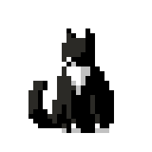

## Hi there, I'm Giovanna Costa 

### A little bit about me:

- Technical degree in Systems Development  
- Undergraduate Computer Science student at UFRPE  
- Member of LASER – Embedded Systems and Robotics Laboratory  

---

### Languages & Tools

---

  
  
